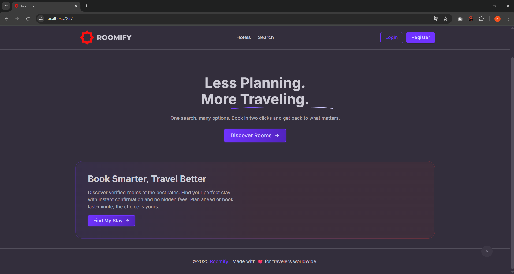
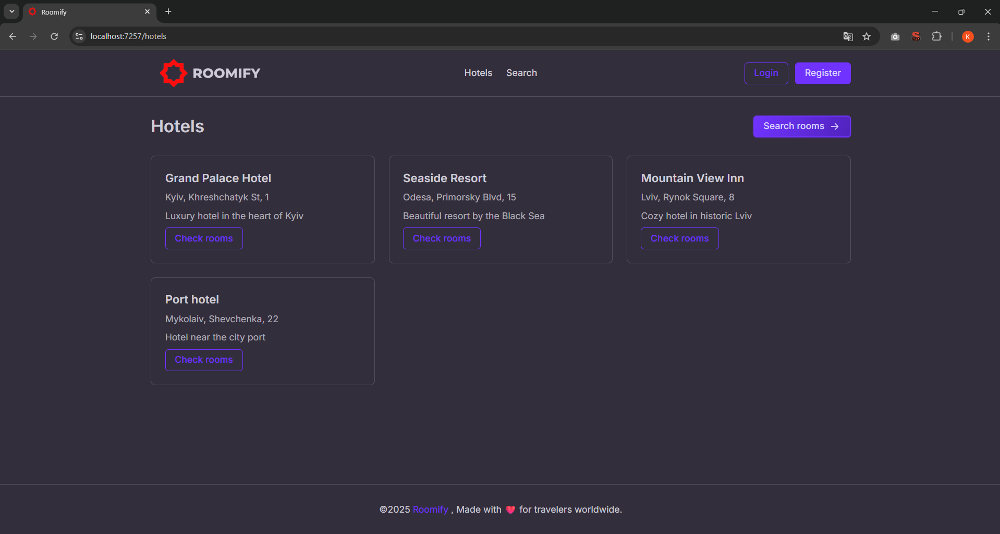
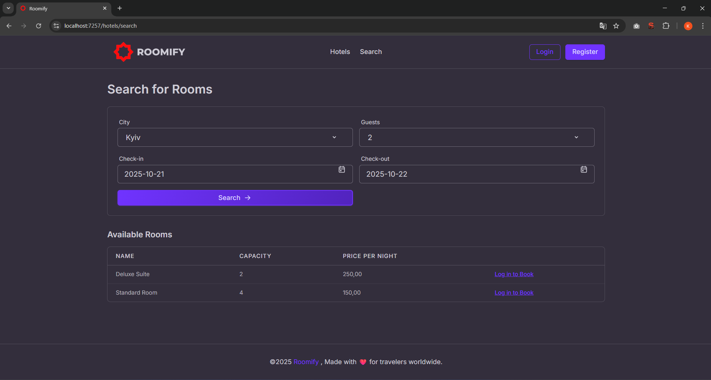
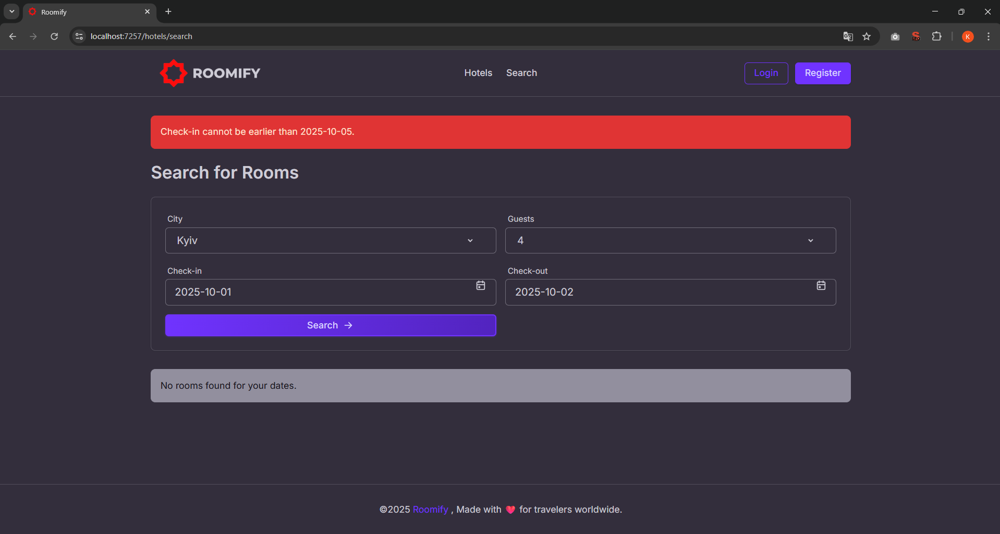
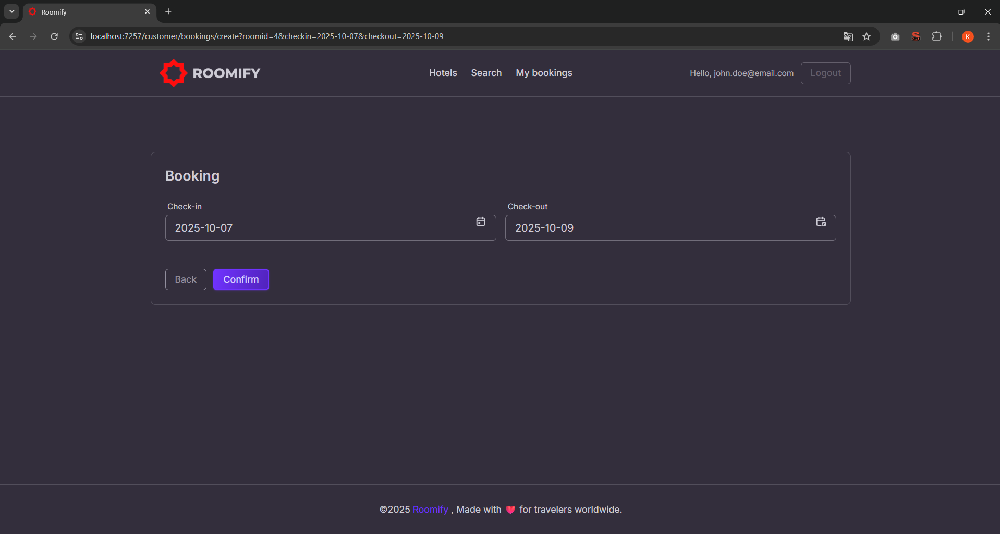
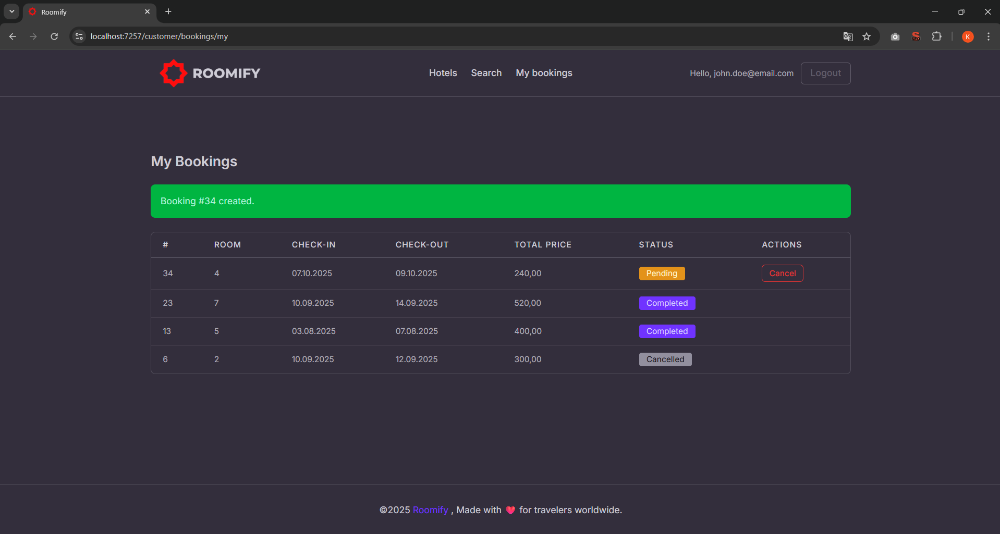
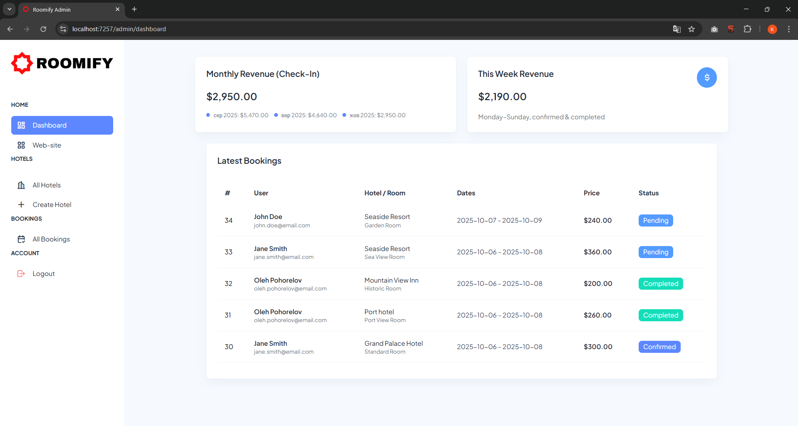
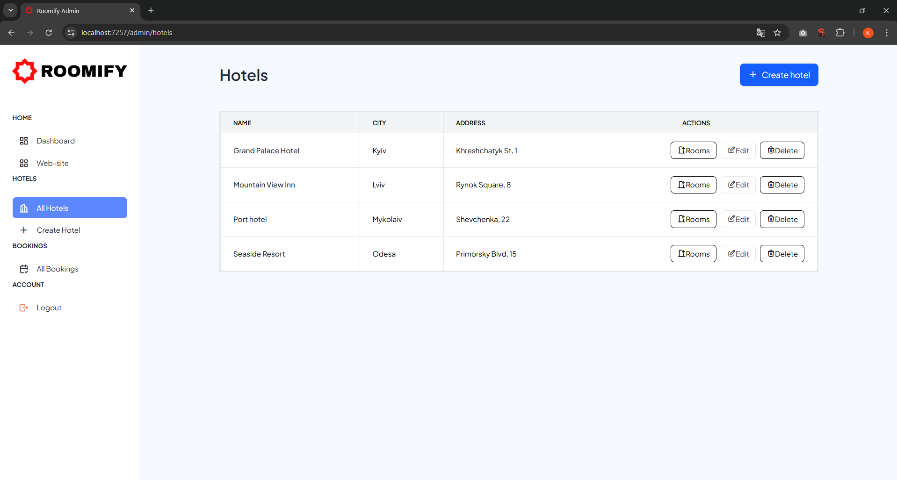
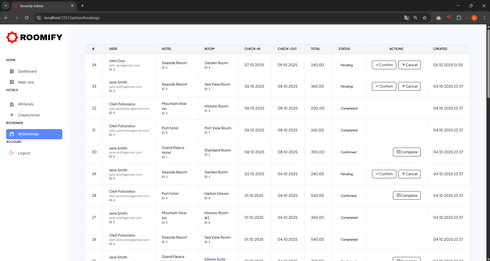
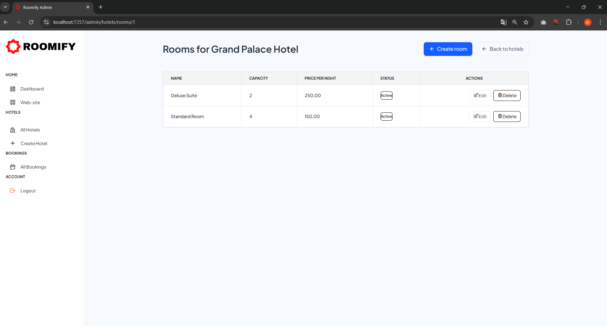

Roomify - ASP.NET Core MVC hotel reservation app
=====================================================

> Multi-layered sample application for browsing hotels, searching rooms, and making bookings. Built with **ASP.NET Core MVC**, **EF Core + MySQL 8**, **Tailwind CSS**, and fully **Dockerized**.

Overview
--------

**HotelBooking** is a demo web app that showcases an end-to-end booking flow with an **Admin** area for managing hotels/rooms and a **Customer** area for creating and managing bookings.UI styling is adapted from:

*   Client-side theme: [**FlyonUI**](https://github.com/themeselection/flyonui) (Tailwind components)
    
*   Admin dashboard styling: [**Modernize Tailwind**](https://adminmart.com/product/modernize-tailwind-nextjs-dashboard-template/) (ported into MVC views)
    

The solution uses a clean, layered structure (Domain → Application → Infrastructure → Web), cookie authentication with roles, and a seed process for demo data.

### Startup Algorithm - seed with Docker, then develop in Visual Studio

**Goal:** bring up MySQL + app in Docker once (migrate & seed), then keep only DB running and launch the app from Visual Studio.

```bash
# One-time (Docker: DB + seed)
# From repo root
docker compose up --build -d
# (DB: hotelbooking-mysql, APP: hotelbooking-webapp, Adminer: hotelbooking-dbadmin)

# Watch app until migrations/seed finish
docker logs -f hotelbooking-webapp
# Or open Adminer: http://localhost:9000 (db: hotelbooking_db)

# Run from Visual Studio
# Start HotelBooking.Web (F5)
```

Key Features
------------

*   **Cookie auth** (app-cookie) with **roles**: Admin, Client
    
*   **CRUD for Hotels & Rooms** (Admin area)
    
*   **Room search** by city/capacity/availability (no overlapping bookings)
    
*   **Bookings** server-side date validation, and status transitions
    
*   **Admin dashboard**: weekly revenue, latest bookings, last 3 months revenue
    
*   **Soft delete policy** for rooms with existing bookings
    
*   **Docker-compose** for app + MySQL + Adminer
    
*   **Data seeder** for demo hotels/rooms/users/bookings
    
*   **Tailwind CSS** UI with separate layouts for Admin and Customer

## 📸 See screenshots

<details>
<summary>Click to expand gallery</summary>

| # | Screenshot | Preview |
|:-:|-------------|----------|
| 1 | **Landing page** |  |
| 2 | **Discover rooms** |  |
| 3 | **Search for rooms** |  |
| 4 | **Search error state** |  |
| 5 | **Confirm booking** |  |
| 6 | **Booking created** |  |
| 7 | **Admin dashboard** |  |
| 8 | **All hotels list** |  |
| 9 | **Booking management** |  |
| 10 | **Rooms management** |  |

</details>

Architecture Overview
---------------------

*   **Domain** - Entities, enums, business rules
    
*   **Application** - DTOs and service interfaces
    
*   **Infrastructure** - EF Core AppDbContext, repository/service implementations, Dapper stats, security utilities
    
*   **Web** - ASP.NET Core MVC app (Areas: **Admin**, **Customer** + public controllers); two distinct layouts/styles

Tech Stack
----------

*   **Backend**: ASP.NET Core 8 MVC, Cookie Auth
    
*   **Data**: EF Core 8 + **Pomelo.EntityFrameworkCore.MySql** (MySQL 8), **Dapper** + **MySqlConnector** for admin stats
    
*   **UI**: Tailwind CSS (FlyonUI for customer, Modernize-style for admin)
    
*   **Security**: PBKDF2 (SHA-256)
    
*   **Containers**: Docker, docker-compose
    
*   **Misc**: Seeding, DateOnly converters, optimistic concurrency (RowVersion)

Security
--------

*   **Authentication**: Cookie scheme app-cookie, sliding expiration **7 days**; login, register, logout via AccountController.
    
*   **Authorization**: Role-based (Admin, Client). Admin controllers are restricted with \[Authorize(Roles="Admin")\].
    
*   **Password hashing**: **PBKDF2** (SHA-256).
    
*   **HTTPS**: enable in production; configure reverse proxy and cookie security flags accordingly.

Web Areas & Routes
------------------

**Public**

*   HomeController.Index - landing
    
*   HotelsController.Index - list/search UI
    
*   HotelsController.Search - GET (filters), POST (executes search)
    
*   JSON helpers: CityOptions(), CapacityOptions(city, checkIn?, checkOut?)
    

**Customer Area** (authorized)

*   BookingsController.Create - GET/POST (validates dates)
    
*   BookingsController.My - GET (current user bookings)
    
*   BookingsController.Cancel - POST
    

**Admin Area** (role: Admin)

*   DashboardController.Index - weekly revenue, latest bookings, last 3 months revenue
    
*   BookingsController.Index - joined admin list; UpdateStatus(id, status) (POST)
    
*   HotelsController.Index | Create (GET/POST) | Edit (GET/POST) | Delete (POST) | Rooms(id)
    

Admin Dashboard
---------------

*   **Weekly Revenue**: Monday–Sunday window; sums TotalPrice for **Confirmed**/**Completed** (aggregated by CheckIn).
    
*   **Latest Bookings**: recent N bookings with joined User/Hotel/Room data (ordered by CreatedAtUtc DESC).
    
*   **Last 3 Months**: monthly aggregation by CheckIn month (fills missing months with zeros).Implemented via **Dapper** + **MySqlConnector** for efficiency.
